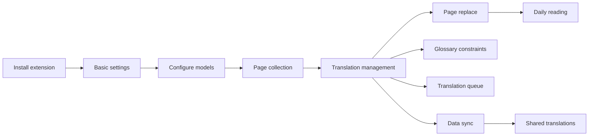

LayerAI splits foreign-language reading into two stages: “translate first, then reuse while unchanged.” The diagram below shows how modules connect—click a card to open that module hub.

## Getting started path

<CardGroup cols={2}>
  <Card title="Install the Extension" icon="download" href="/journey/install">
    Install LayerAI from the Chrome or Firefox store.
  </Card>
  <Card title="Basic Settings" icon="settings" href="/journey/basic-settings">
    Configure UI language, target language, and theme.
  </Card>
  <Card title="Configure Models" icon="cpu" href="/modules/models">
    Choose a platform model or custom API to enable AI translation.
  </Card>
  <Card title="Your First Translation" icon="sparkles" href="/journey/first-translation">
    End-to-end demo: collect → translate → save → auto-replace.
  </Card>
</CardGroup>

## Features

<CardGroup cols={3}>
  <Card title="Page Collection" icon="mouse-pointer" href="/modules/collection">
    Manual selection, current page, and whole-site collection.
  </Card>
  <Card title="Translation Management" icon="language" href="/modules/translation">
    Manage entries by site; AI batch translate and submit to share.
  </Card>
  <Card title="Page Replace" icon="repeat" href="/modules/replace">
    Auto-replace toggle and exact / content-match modes.
  </Card>
  <Card title="Glossary" icon="book-a" href="/modules/glossary">
    Local and platform terms to keep AI translations consistent.
  </Card>
  <Card title="Translation Queue" icon="list-ordered" href="/modules/queue">
    Background AI batch jobs with progress tracking and retries.
  </Card>
  <Card title="Data Sync" icon="cloud" href="/modules/sync">
    Local JSON, Layer cloud, and Google Drive backups.
  </Card>
  <Card title="Shared Translations" icon="share-2" href="/modules/shared">
    Browse and download community packs; submit whole-site translations.
  </Card>
  <Card title="Account & Settings" icon="credit-card" href="/modules/account-settings">
    Plans, basic settings, and advanced developer options.
  </Card>
</CardGroup>

## Typical workflows

1. **First translation for a site** — [Page collection](/modules/collection) → [Translation management](/modules/translation) → [Page replace](/modules/replace)
2. **Terminology consistency** — Maintain terms in the [glossary](/modules/glossary); AI translation applies them automatically
3. **Whole-site batch** — [Whole-site collection](/collection/current-site) → process in the [translation queue](/modules/queue)
4. **Collaboration and backup** — [Data sync](/modules/sync) across devices; [shared translations](/modules/shared) to exchange whole-site packs with the community

<Tip>
  Complete [Your first translation](/journey/first-translation) hands-on first, then dive into each module hub and reference as needed.
</Tip>
