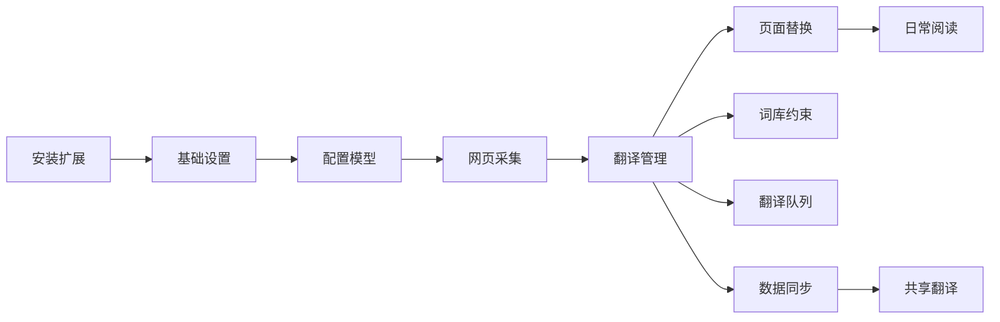

LayerAI 将外文阅读拆成「先翻译、后使用」两阶段。下图展示各模块如何串联，点击卡片进入对应模块概览。

## 入门路径

<CardGroup cols={2}>
  <Card title="安装扩展" icon="download" href="/journey/install">
    从应用商店或本地包安装 LayerAI。
  </Card>
  <Card title="基础设置" icon="settings" href="/journey/basic-settings">
    配置界面语言、目标语言与主题。
  </Card>
  <Card title="配置模型" icon="cpu" href="/modules/models">
    选择平台模型或自定义 API，完成 AI 翻译前置配置。
  </Card>
  <Card title="第一个翻译流程" icon="sparkles" href="/journey/first-translation">
    端到端演示采集 → 翻译 → 保存 → 自动替换。
  </Card>
</CardGroup>

## 功能模块

<CardGroup cols={3}>
  <Card title="网页采集" icon="mouse-pointer" href="/modules/collection">
    手动框选、当前页、整站三种采集方式。
  </Card>
  <Card title="翻译管理" icon="language" href="/modules/translation">
    按站点管理词条，AI 批量翻译与提交共享。
  </Card>
  <Card title="页面替换" icon="repeat" href="/modules/replace">
    自动替换开关与精确 / 内容匹配两种模式。
  </Card>
  <Card title="词库" icon="book-a" href="/modules/glossary">
    本地与平台术语，约束 AI 译法一致性。
  </Card>
  <Card title="翻译队列" icon="list-ordered" href="/modules/queue">
    后台批量 AI 任务，进度追踪与失败重试。
  </Card>
  <Card title="数据同步" icon="cloud" href="/modules/sync">
    本地 JSON、Layer 云、Google Drive 备份。
  </Card>
  <Card title="共享翻译" icon="share-2" href="/modules/shared">
    浏览下载社区翻译包，提交整站译文。
  </Card>
  <Card title="账号与设置" icon="credit-card" href="/modules/account-settings">
    订阅套餐、基础配置与高级开发者选项。
  </Card>
</CardGroup>

## 典型工作流

1. **首次翻译某站点** — [网页采集](/modules/collection) → [翻译管理](/modules/translation) → [页面替换](/modules/replace)
2. **术语一致性** — 在 [词库](/modules/glossary) 维护术语，AI 翻译时自动约束
3. **整站批量** — [整站采集](/collection/current-site) → [翻译队列](/modules/queue) 后台处理
4. **协作与备份** — [数据同步](/modules/sync) 跨设备，[共享翻译](/modules/shared) 与社区交换整站包

<Tip>
  建议先完成 [第一个翻译流程](/journey/first-translation) 实操，再按需深入各模块 Hub 与参考手册。
</Tip>
